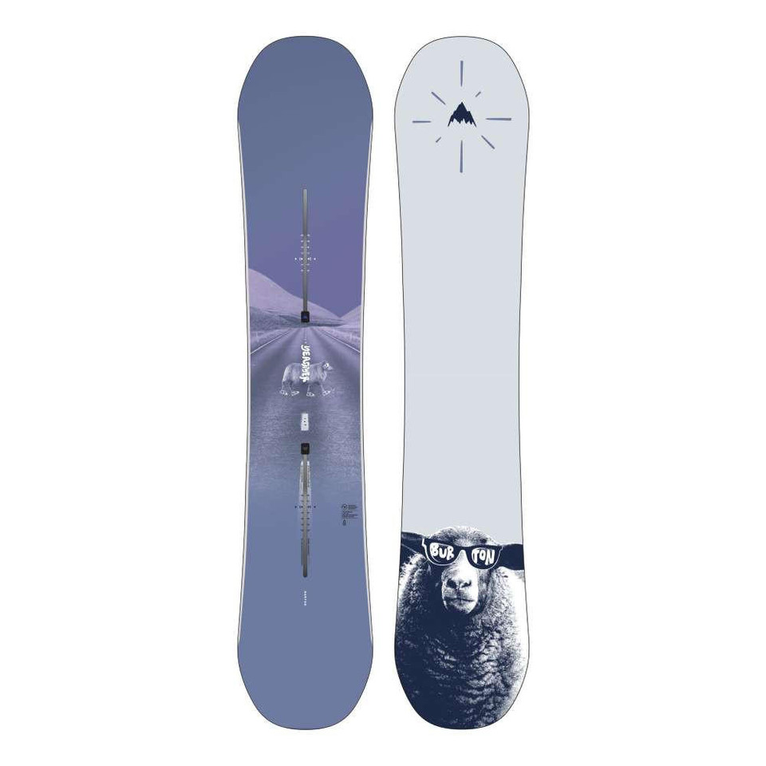
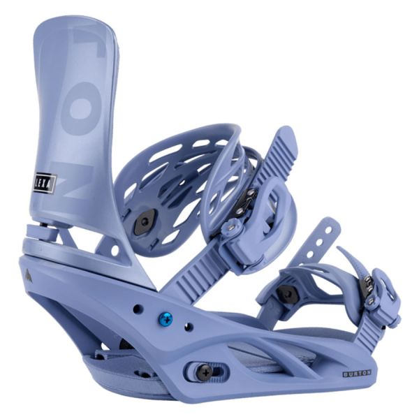

# Gear Reviews

Discover the best snowboarding gear for your adventures. From snowboards to bindings, find reviews and recommendations to help you gear up for the slopes.

## Snowboards

### Burton YEASAYER SNOWBOARD 2024
Twin Shape and flex are perfectly symmetrical for a balanced ride that lets you spin and stomp as you like, regular or switch.

**Features:**
- **Type**: PARK
- **Flex**: SOFT
- **Best For**: Intermediate to advanced riders

## Bindings

### Burton Lexa Re:Flex Bindings
The Burton Lexa Snowboard Bindings are built for the hard charger, the ripper who's out there for the good and the bad, whether it's waist deep or boilerplate. They're built with stiff nylon composite Re:Flex™ baseplates, cushy FullBED footbeds to soak up impacts, and extra-responsive ankle and toe straps to keep you locked in tight, no matter how rowdy your ride gets. Just like you, they have the guts to perform no matter what the conditions hold, so grab the Lexas and get after it.

**Features:**
- **Flex**: Medium-Stiff Flex