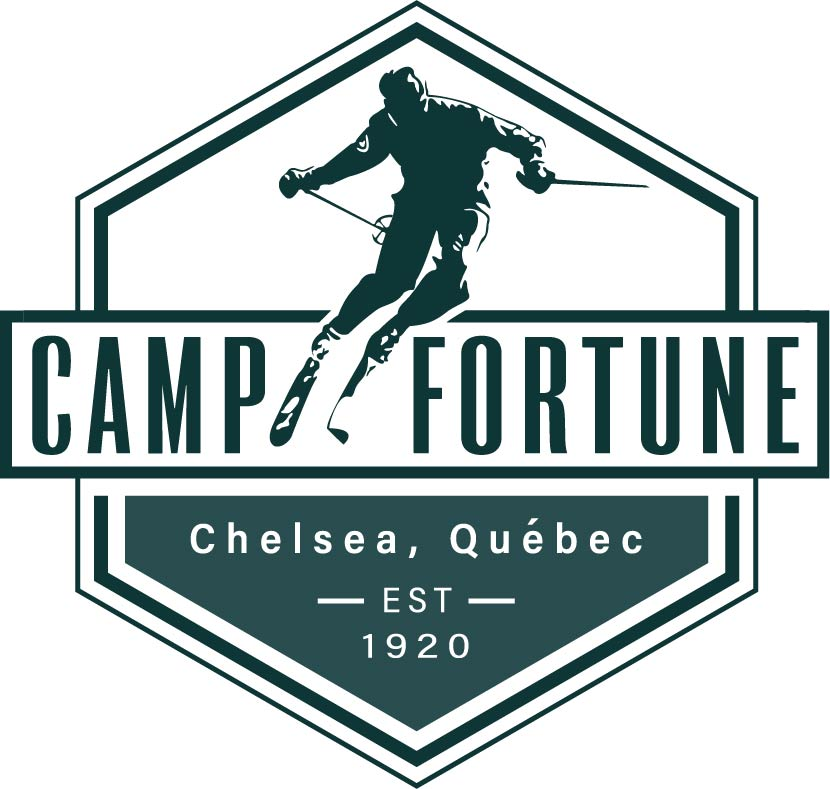
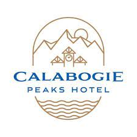

# Ski Resorts Near Ottawa, Canada

Ottawa is surrounded by some fantastic ski venues that offer great slopes and beautiful scenery. Here are a few of my favorites:

## Camp Fortune
Camp Fortune is the closest ski hill to Ottawa, just a 15-minute drive from downtown. It's a great spot for a quick day trip and offers both skiing and snowboarding options.

## Calabogie Peaks
Calabogie Peaks is located about an hour from Ottawa and offers some of the highest vertical drops in Ontario. It’s a fantastic place for more experienced skiers and snowboarders looking for a challenge.

These venues offer a range of experiences for all skill levels and are perfect for a weekend getaway or a quick day trip from Ottawa. Whether you're a beginner or an experienced rider, you'll find something to enjoy.

## Mont Tremblant
Located about 2 hours from Ottawa, Mont Tremblant is one of the most popular ski resorts in Eastern Canada. It offers a wide variety of trails for all skill levels, from beginner to expert.

